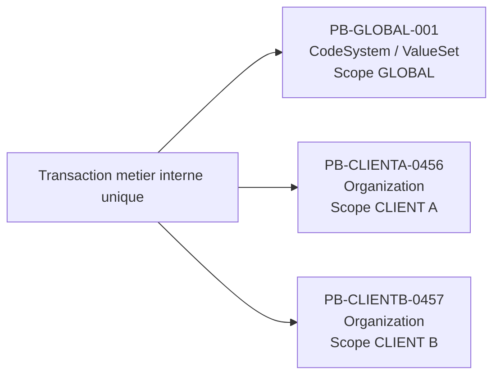

# API FHIR de recuperation des lots publies

## Objectif

Cette page decrit le contrat d'API FHIR utilise pour permettre aux systemes consommateurs de recuperer les lots publies par le Master Data, apres notification de disponibilite recue sur NATS.

L'objectif est de :

- notifier de maniere asynchrone qu'un lot est disponible ;
- permettre au consommateur de recuperer les metadonnees du lot ;
- permettre au consommateur de recuperer le contenu publiable sous forme de Bundle FHIR ;
- gerer a la fois les publications globales et les publications contextualisees par client ;
- rester coherent avec le modele de publication expose dans cette IG.

## 1. Principe general

Le broker ne transporte pas directement le contenu complet des donnees publiees.

Il transporte une notification de disponibilite d'un lot de publication.

Le consommateur suit ensuite le cycle suivant :

1. il recoit une notification sur NATS ;
2. il recupere les metadonnees du lot publie ;
3. il recupere le contenu du lot via une operation FHIR dediee ;
4. il applique localement les creations, mises a jour, suppressions ou fusions concernees ;
5. il peut ensuite publier son statut de synchronisation selon le protocole retenu par l'ecosysteme.

## 2. Pourquoi une API FHIR dediee

Le standard FHIR permet :

- de soumettre un Bundle de type `transaction` ou `batch` ;
- d'exposer des operations personnalisees via le mecanisme `$operation` ;
- d'executer certaines operations en mode asynchrone.

En revanche, FHIR ne definit pas nativement une API standard du type :

- "donne-moi le lot publie numero X" ;
- ou "redonne-moi la transaction publiee suite a l'evenement Y".

Il est donc necessaire d'exposer des operations FHIR custom au niveau systeme.

## 3. Positionnement dans l'architecture

Le cycle global est le suivant :

1. une transaction metier est validee dans le Master Data ;
2. un ou plusieurs lots de publication sont construits ;
3. une notification de disponibilite est emise sur NATS ;
4. les consommateurs interesses recuperent le lot via l'API FHIR ;
5. les consommateurs appliquent le lot localement.

## 4. Typologie des lots publies

### 4.1 Lot global

Un lot global correspond a un contenu identique pour tous les destinataires.

Cas typiques :

- nomenclatures ;
- `CodeSystem` ;
- `ValueSet` ;
- jeux de reference partages.

Caracteristiques :

- pas de contexte client specifique ;
- pas d'identifiant local client a injecter ;
- meme contenu pour tous les consommateurs.

### 4.2 Lot contextualise par client

Un lot contextualise correspond a un contenu dependant du client destinataire.

Cas typiques :

- `Organization` ;
- `Practitioner` ;
- `Location` ;
- autres ressources metier publiees avec identifiants ou visibilite specifiques.

Caracteristiques :

- un client cible explicite ;
- des identifiants locaux specifiques ;
- un contenu potentiellement different selon le destinataire.

## 5. Principe de decoupage des publications

Une transaction metier interne peut impacter plusieurs objets en meme temps.

Exemple :

- mise a jour d'une nomenclature ;
- mise a jour d'une ressource metier.

Dans ce cas, la diffusion ne doit pas necessairement reprendre la transaction interne telle quelle.

Le principe retenu est le suivant :

- une transaction interne peut produire plusieurs lots de publication ;
- chaque lot publie doit rester homogene en termes de perimetre de diffusion ;
- les lots globaux et les lots client-specifiques doivent etre separes.

## 6. Operations FHIR exposees

Deux operations sont exposees :

- [`$publication-metadata`](OperationDefinition-publication-metadata.html)
- [`$publication-bundle`](OperationDefinition-publication-bundle.html)

## 7. Operation `$publication-metadata`

### 7.1 Objectif

Cette operation permet de recuperer les metadonnees d'un lot publie.

Elle remplace un endpoint generique du type `GET /version/{id}`.

Elle permet au consommateur de comprendre :

- la nature du lot ;
- son scope ;
- le type de bundle attendu ;
- les ressources concernees ;
- le client cible eventuel ;
- la version source ;
- le statut du lot.

### 7.2 Endpoint

```http
POST /fhir/$publication-metadata
Content-Type: application/fhir+json
```

### 7.3 Parametres d'entree

L'entree est portee par une ressource `Parameters`.

```json
{
  "resourceType": "Parameters",
  "parameter": [
    {
      "name": "publicationBatchId",
      "valueString": "PB-2026-000145"
    }
  ]
}
```

### 7.4 Parametres de sortie

Exemple pour un lot `CLIENT` :

```json
{
  "resourceType": "Parameters",
  "parameter": [
    {
      "name": "publicationBatchId",
      "valueString": "PB-2026-000145"
    },
    {
      "name": "scope",
      "valueCode": "CLIENT"
    },
    {
      "name": "targetTenant",
      "valueString": "ght21"
    },
    {
      "name": "bundleType",
      "valueCode": "transaction"
    },
    {
      "name": "publicationViewCode",
      "valueString": "ORG_GHT21"
    },
    {
      "name": "sourceTransactionId",
      "valueString": "TX-2026-000987"
    },
    {
      "name": "sourceVersionNum",
      "valueInteger": 54
    },
    {
      "name": "resourceType",
      "valueString": "Organization"
    },
    {
      "name": "resourceType",
      "valueString": "Location"
    },
    {
      "name": "status",
      "valueCode": "READY"
    },
    {
      "name": "createdAt",
      "valueDateTime": "2026-03-30T09:15:00Z"
    }
  ]
}
```

Exemple pour un lot `GLOBAL` :

```json
{
  "resourceType": "Parameters",
  "parameter": [
    {
      "name": "publicationBatchId",
      "valueString": "PB-GLOBAL-001"
    },
    {
      "name": "scope",
      "valueCode": "GLOBAL"
    },
    {
      "name": "bundleType",
      "valueCode": "batch"
    },
    {
      "name": "publicationViewCode",
      "valueString": "NOMENCLATURES_GLOBAL"
    },
    {
      "name": "sourceTransactionId",
      "valueString": "TX-2026-000654"
    },
    {
      "name": "sourceVersionNum",
      "valueInteger": 12
    },
    {
      "name": "resourceType",
      "valueString": "CodeSystem"
    },
    {
      "name": "resourceType",
      "valueString": "ValueSet"
    },
    {
      "name": "status",
      "valueCode": "READY"
    },
    {
      "name": "createdAt",
      "valueDateTime": "2026-03-30T08:30:00Z"
    }
  ]
}
```

## 8. Operation `$publication-bundle`

### 8.1 Objectif

Cette operation permet de recuperer le contenu publie sous forme de Bundle FHIR.

Elle remplace des endpoints generiques de type :

- `GET /data/{type}`
- `GET /file/{type}`

### 8.2 Endpoint

```http
POST /fhir/$publication-bundle
Content-Type: application/fhir+json
```

### 8.3 Parametres d'entree

Exemple minimal :

```json
{
  "resourceType": "Parameters",
  "parameter": [
    {
      "name": "publicationBatchId",
      "valueString": "PB-2026-000145"
    }
  ]
}
```

Exemple explicite pour un lot `CLIENT` :

```json
{
  "resourceType": "Parameters",
  "parameter": [
    {
      "name": "publicationBatchId",
      "valueString": "PB-2026-000145"
    },
    {
      "name": "targetTenant",
      "valueString": "ght21"
    },
    {
      "name": "publicationViewCode",
      "valueString": "ORG_GHT21"
    }
  ]
}
```

### 8.4 Reponse synchrone

Si le lot est disponible immediatement et de volumetrie raisonnable, l'API retourne directement un `Bundle`.

Exemple pour un lot `CLIENT` :

```json
{
  "resourceType": "Bundle",
  "type": "transaction",
  "timestamp": "2026-03-30T09:15:02Z",
  "entry": [
    {
      "resource": {
        "resourceType": "Organization",
        "id": "ORG-GHT21-4589",
        "identifier": [
          {
            "system": "urn:ght21:tiers",
            "value": "4589"
          }
        ],
        "name": "Clinique Exemple"
      },
      "request": {
        "method": "PUT",
        "url": "Organization/ORG-GHT21-4589"
      }
    }
  ]
}
```

Exemple pour un lot `GLOBAL` :

```json
{
  "resourceType": "Bundle",
  "type": "batch",
  "timestamp": "2026-03-30T08:30:02Z",
  "entry": [
    {
      "resource": {
        "resourceType": "CodeSystem",
        "id": "codes-postaux-fr",
        "url": "https://www.cpage.fr/fhir/CodeSystem/codes-postaux-fr",
        "version": "2026-03",
        "status": "active"
      },
      "request": {
        "method": "PUT",
        "url": "CodeSystem/codes-postaux-fr"
      }
    }
  ]
}
```

### 8.5 Reponse asynchrone

Le mode asynchrone est recommande lorsque :

- le lot est volumineux ;
- la reconstruction prend du temps ;
- la generation du bundle ne doit pas bloquer le client.

Appel :

```http
POST /fhir/$publication-bundle
Prefer: respond-async
Content-Type: application/fhir+json
```

Reponse immediate :

```http
HTTP/1.1 202 Accepted
Content-Location: /fhir/async-jobs/12345
```

Polling :

```http
GET /fhir/async-jobs/12345
```

Resultat :

- `202 Accepted` tant que le traitement est en cours ;
- `200 OK` avec le Bundle quand il est pret ;
- `OperationOutcome` en cas d'erreur.

## 9. Gestion des erreurs (OperationOutcome)

En cas d'erreur, le serveur retourne une ressource FHIR `OperationOutcome`.

### 9.1 Structure attendue

```json
{
  "resourceType": "OperationOutcome",
  "issue": [
    {
      "severity": "error",
      "code": "not-found",
      "details": {
        "text": "Lot de publication PB-2026-000999 inconnu."
      },
      "diagnostics": "publicationBatchId PB-2026-000999 not found"
    }
  ]
}
```

### 9.2 Codes d'erreur fonctionnels

| Situation | HTTP | `issue.code` | Description |
|---|---|---|---|
| Batch inconnu | 404 | `not-found` | `publicationBatchId` ne correspond a aucun lot connu. |
| Parametres invalides | 400 | `required` / `value` | Parametre obligatoire manquant ou valeur incoherente. |
| Acces interdit | 403 | `forbidden` | Le jeton de l'appelant n'autorise pas l'acces a ce lot. |
| Lot non pret | 409 | `conflict` | Le lot existe mais son statut n'est pas READY (ex. PROCESSING, FAILED). |
| Incoherence tenant | 422 | `business-rule` | Le `targetTenant` transmis ne correspond pas au lot demande. |
| Incoherence vue | 422 | `business-rule` | Le `publicationViewCode` transmis ne correspond pas au lot demande. |
| Erreur interne | 500 | `exception` | Erreur inattendue cote serveur. |

## 10. Gestion des abonnements partiels

Le lot retourne par l'API ne doit pas forcement etre la transaction metier brute.

Il doit etre une projection de publication adaptee au destinataire.

Consequence :

- si un consommateur n'est abonne qu'a une partie du contenu impacte, il ne recoit que le perimetre qui lui est destine ;
- les ressources non visibles ne sont pas incluses ;
- les dependances minimales eventuellement necessaires doivent etre definies par la vue de publication.

## 11. Cas des nomenclatures

Pour les nomenclatures, le lot est generalement de scope `GLOBAL`.

Deux possibilites :

- recuperation via `$publication-bundle` ;
- recuperation via API FHIR standard si l'artefact est expose nativement comme `CodeSystem` ou `ValueSet`.

## 12. Cas des ressources client-specifiques

Pour les ressources metier, le lot est de scope `CLIENT`.

Le bundle retourne est alors tenant-aware et inclut uniquement les identifiants et contenus visibles pour le client concerne.

## 13. Contrat de notification broker

Le broker ne transporte pas la totalite du lot publie.
Il transporte uniquement la notification de disponibilite.

Payload minimal recommande :

```json
{
  "messageId": "msg-002",
  "correlationId": "evt-001",
  "publicationBatchId": "PB-CLIENTA-0456",
  "scope": "CLIENT",
  "targetTenant": "clientA",
  "bundleType": "transaction",
  "resourceTypes": ["Organization", "Location"],
  "occurredAt": "2026-03-30T09:15:00Z"
}
```

## 14. Regle de decoupage lors d'une transaction mixte

Une meme transaction metier interne peut inclure des operations de nature differente, par exemple :

- mise a jour d'une nomenclature (`CodeSystem` / `ValueSet`) ;
- recalcul et mise a jour des ressources metier qui dependent de cette nomenclature.

Exemple concret :

1. L'equipe metier modifie des codes de specialite dans un `CodeSystem`.
2. Dans la meme transaction applicative, Master Data recalcule des `Organization` qui portent ces codes.
3. Les changements sont valides atomiquement cote metier (une seule transaction interne).

Dans ce cas, la diffusion externe ne doit pas exposer un seul bundle mixte, car les perimetres de diffusion ne sont pas les memes :

- la nomenclature est en general `GLOBAL` ;
- les ressources metier peuvent etre `CLIENT` (tenant-aware).

Donc, a partir d'une transaction interne unique, il faut publier plusieurs batches homogenes :

- `PB-GLOBAL-001` pour `CodeSystem` ;
- `PB-CLIENTA-0456` pour `Organization` client A ;
- `PB-CLIENTB-0457` pour `Organization` client B.

Schema simplifie :



Ce decoupage permet de conserver :

- la coherence metier interne (transaction unique) ;
- un contrat de diffusion propre et securise (GLOBAL separe de CLIENT).

## 15. Regles normatives

- La notification broker ne transporte pas directement la transaction metier interne complete.
- La recuperation du lot se fait via une operation FHIR dediee.
- Le lot retourne par l'API est une projection de publication, pas necessairement la transaction metier brute.
- Les lots globaux et les lots client-specifiques doivent etre distingues.
- Un lot client-specifique ne doit exposer que les donnees visibles pour le client concerne.
- Le contenu d'un lot est defini par la vue de publication.
- Le mode asynchrone doit etre utilise lorsque la volumetrie ou le temps de traitement le justifie.
- Le consommateur doit pouvoir correler le lot recupere avec la notification broker recue.

## 16. Conclusion

L'API FHIR de recuperation des lots publies permet de decoupler :

- la notification de disponibilite ;
- la recuperation des metadonnees ;
- la recuperation du contenu ;
- l'application locale par le consommateur.

Elle permet egalement de traiter proprement :

- les nomenclatures globales ;
- les ressources contextualisees par client ;
- les lots volumineux ;
- les abonnements partiels ;
- les besoins de tracabilite et de rejouabilite.

## 17. Rattachement des artefacts IG

- OperationDefinition metadata : [OperationDefinition-publication-metadata.html](OperationDefinition-publication-metadata.html)
- OperationDefinition bundle : [OperationDefinition-publication-bundle.html](OperationDefinition-publication-bundle.html)
- CapabilityStatement serveur : [CapabilityStatement-mdm-publication-server.html](CapabilityStatement-mdm-publication-server.html)
- Cas NATS : [nats-cases.html](nats-cases.html)
- Modele logique PublicationBatch : [StructureDefinition-PublicationBatch.html](StructureDefinition-PublicationBatch.html)


- les metadonnees d'un lot publie ;
- le contenu d'un lot publie.

Le design cible est base sur des operations FHIR custom :

- `POST /fhir/$publication-metadata`
- `POST /fhir/$publication-bundle`

## 2. Principes de diffusion

- La transaction metier interne n'est pas exposee directement.
- La notification broker annonce la disponibilite d'un `PublicationBatch`.
- Le consommateur recupere ensuite les informations du lot via API FHIR.
- Si une transaction interne melange des contenus heterogenes, plusieurs lots homogenes sont produits (GLOBAL et CLIENT separes).

## 3. Operation `$publication-metadata`

### 3.1 Endpoint

- Methode : `POST`
- URL : `/fhir/$publication-metadata`
- Content-Type : `application/fhir+json`

### 3.2 Entree

Ressource FHIR `Parameters`.

```json
{
  "resourceType": "Parameters",
  "parameter": [
    {
      "name": "publicationBatchId",
      "valueString": "PB-2026-000145"
    }
  ]
}
```

### 3.3 Sortie

Ressource FHIR `Parameters`.

```json
{
  "resourceType": "Parameters",
  "parameter": [
    {
      "name": "publicationBatchId",
      "valueString": "PB-2026-000145"
    },
    {
      "name": "scope",
      "valueCode": "GLOBAL"
    },
    {
      "name": "bundleType",
      "valueCode": "transaction"
    },
    {
      "name": "resourceType",
      "valueString": "Organization"
    },
    {
      "name": "resourceType",
      "valueString": "CodeSystem"
    },
    {
      "name": "sourceVersionNum",
      "valueInteger": 54
    }
  ]
}
```

### 3.4 Regles de validation

- `publicationBatchId` obligatoire.
- Si batch inconnu : erreur FHIR `OperationOutcome`.
- Si lot `CLIENT` : `targetTenant` retourne si applicable.

## 4. Operation `$publication-bundle`

### 4.1 Endpoint

- Methode : `POST`
- URL : `/fhir/$publication-bundle`
- Content-Type : `application/fhir+json`

### 4.2 Entree

Ressource FHIR `Parameters` contenant :

- `publicationBatchId` obligatoire ;
- `targetTenant` optionnel ;
- `publicationViewCode` optionnel.

```json
{
  "resourceType": "Parameters",
  "parameter": [
    {
      "name": "publicationBatchId",
      "valueString": "PB-2026-000145"
    },
    {
      "name": "targetTenant",
      "valueString": "ght21"
    },
    {
      "name": "publicationViewCode",
      "valueString": "ORG_GHT21"
    }
  ]
}
```

### 4.3 Sortie synchrone

Si lot disponible et volumetrie raisonnable : retour direct d'un `Bundle` FHIR.

```json
{
  "resourceType": "Bundle",
  "type": "transaction",
  "timestamp": "2026-03-30T09:15:02Z",
  "entry": [
    {
      "resource": {
        "resourceType": "Organization",
        "id": "ORG-GHT21-4589",
        "name": "Clinique Exemple"
      },
      "request": {
        "method": "PUT",
        "url": "Organization/ORG-GHT21-4589"
      }
    }
  ]
}
```

### 4.4 Sortie asynchrone

Pour lot volumineux / traitement differe :

- requete avec `Prefer: respond-async` ;
- reponse `202 Accepted` ;
- en-tete `Content-Location` pour polling.

Exemple reponse initiale :

```http
HTTP/1.1 202 Accepted
Content-Location: /fhir/$publication-bundle-status/job-a1b2c3d4
```

Puis polling :

- `GET /fhir/$publication-bundle-status/job-a1b2c3d4`
- tant que le traitement est en cours : `200 OK` avec un `OperationOutcome` indiquant l'avancement ;
- quand le traitement est termine : `200 OK` avec le `Bundle` FHIR en corps de reponse.

Note : l'URL `Content-Location` est opaque. Le consommateur ne doit pas tenter de l'interpreter — il doit uniquement la réutiliser pour le polling.

## 5. Codes retour recommandes

### 5.1 `$publication-metadata`

- `200 OK` : metadonnees retournees.
- `400 Bad Request` : parametres invalides.
- `404 Not Found` : batch inexistant.
- `403 Forbidden` : acces interdit au batch.

### 5.2 `$publication-bundle`

- `200 OK` : bundle retourne en synchrone.
- `202 Accepted` : traitement asynchrone demarre.
- `400 Bad Request` : parametres invalides.
- `404 Not Found` : batch inexistant.
- `409 Conflict` : batch non pret.

## 6. Gestion des erreurs (OperationOutcome)

En cas d'erreur, le serveur retourne une ressource FHIR `OperationOutcome`.

### 6.1 Structure attendue

```json
{
  "resourceType": "OperationOutcome",
  "issue": [
    {
      "severity": "error",
      "code": "not-found",
      "details": {
        "text": "Lot de publication PB-2026-000999 inconnu."
      },
      "diagnostics": "publicationBatchId PB-2026-000999 not found"
    }
  ]
}
```

### 6.2 Codes d'erreur fonctionnels

| Situation | HTTP | `issue.code` | Description |
|---|---|---|---|
| Batch inconnu | 404 | `not-found` | `publicationBatchId` ne correspond a aucun lot connu. |
| Parametres invalides | 400 | `required` / `value` | Parametre obligatoire manquant ou valeur incoherente. |
| Acces interdit | 403 | `forbidden` | Le jeton de l'appelant n'autorise pas l'acces a ce lot. |
| Lot non pret | 409 | `conflict` | Le lot existe mais son statut n'est pas READY (ex. PROCESSING, FAILED). |
| Incoherence tenant | 422 | `business-rule` | Le `targetTenant` transmis ne correspond pas au lot demande. |
| Incoherence vue | 422 | `business-rule` | Le `publicationViewCode` transmis ne correspond pas au lot demande. |
| Erreur interne | 500 | `exception` | Erreur inattendue cote serveur. |

## 7. Cas d'usage de diffusion

### 6.1 Cas A - Nomenclatures globales

Sujet NATS (exemple) :

`publication.global.codesystem.available`

Payload :

```json
{
  "messageId": "msg-001",
  "publicationBatchId": "PB-GLOBAL-001",
  "scope": "GLOBAL",
  "artifactType": "CodeSystem",
  "version": "2026-03"
}
```

Le consommateur recupere ensuite le lot via :

- `$publication-metadata` ;
- `$publication-bundle`.

### 6.2 Cas B - Ressources metier client

Sujet NATS (exemple) :

`publication.clientA.organization.available`

Payload :

```json
{
  "messageId": "msg-002",
  "publicationBatchId": "PB-CLIENTA-0456",
  "scope": "CLIENT",
  "targetTenant": "clientA",
  "resourceType": "Organization"
}
```

Le bundle retourne est tenant-aware.

## 8. Regle de decoupage lors d'une transaction mixte

Une meme transaction metier interne peut inclure des operations de nature differente, par exemple :

- mise a jour d'une nomenclature (`CodeSystem` / `ValueSet`) ;
- recalcul et mise a jour des ressources metier qui dependent de cette nomenclature.

Exemple concret :

1. L'equipe metier modifie des codes de specialite dans un `CodeSystem`.
2. Dans la meme transaction applicative, Master Data recalcule des `Organization` qui portent ces codes.
3. Les changements sont valides atomiquement cote metier (une seule transaction interne).

Dans ce cas, la diffusion externe ne doit pas exposer un seul bundle mixte, car les perimetres de diffusion ne sont pas les memes :

- la nomenclature est en general `GLOBAL` ;
- les ressources metier peuvent etre `CLIENT` (tenant-aware).

Donc, a partir d'une transaction interne unique, il faut publier plusieurs batches homogenes :

- `PB-GLOBAL-001` pour `CodeSystem` ;
- `PB-CLIENTA-0456` pour `Organization` client A ;
- `PB-CLIENTB-0457` pour `Organization` client B.

Schema simplifie :


Ce decoupage permet de conserver :

- la coherence metier interne (transaction unique) ;
- un contrat de diffusion propre et securise (GLOBAL separe de CLIENT).

## 9. Rattachement des artefacts IG

- OperationDefinition metadata : [OperationDefinition-publication-metadata.html](OperationDefinition-publication-metadata.html)
- OperationDefinition bundle : [OperationDefinition-publication-bundle.html](OperationDefinition-publication-bundle.html)
- CapabilityStatement serveur : [CapabilityStatement-mdm-publication-server.html](CapabilityStatement-mdm-publication-server.html)
- Cas NATS : [nats-cases.html](nats-cases.html)
