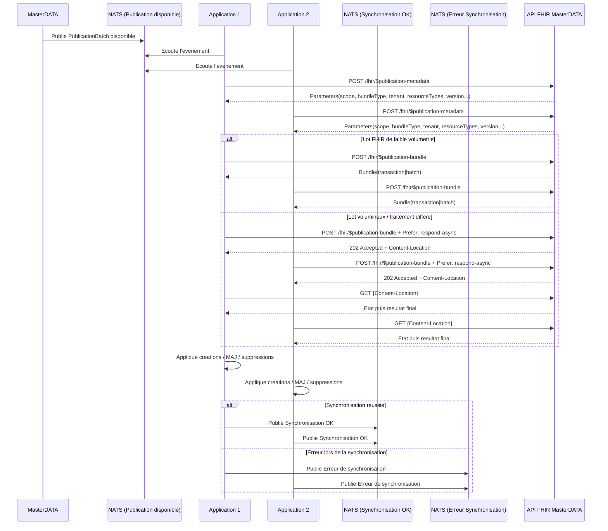

# Cas d'exemple NATS

## Objectif

Cette page decrit le role de NATS dans l'architecture de publication du Master Data et precise les differents cas de notification de disponibilite de lots publies.

Dans cette architecture, NATS est utilise uniquement comme canal de notification expose aux consommateurs.

Les messages publies sur NATS annoncent la disponibilite d'un lot de publication homogene.
Le contenu detaille du lot n'est pas transporte dans le message NATS ; il est recupere ensuite via les operations FHIR de cette IG.

Cette page complete :

- [Operations de publication](operations.html)
- [API FHIR de recuperation des lots publies](api-publication-batch.html)

## 1. Principe general

Le moteur de publication produit des lots de publication.

Lorsqu'un lot est pret :

- le serveur publie une notification NATS ;
- le consommateur recoit cette notification ;
- le consommateur recupere les metadonnees du lot via `$publication-metadata` ;
- le consommateur recupere le contenu du lot via `$publication-bundle`.

Le message NATS ne transporte pas la transaction metier brute.
Il annonce uniquement qu'un lot de publication est disponible.

## 2. Convention de nommage des sujets

La convention recommandee est la suivante.

### 2.1 Lots globaux

```
publication.global.<artifact>.available
```

Exemples :

- `publication.global.codesystem.available`
- `publication.global.valueset.available`
- `publication.global.nomenclature.available`

### 2.2 Lots client-specifiques

```
publication.<tenant>.<resource>.available
```

Exemples :

- `publication.ght21.organization.available`
- `publication.ght21.transaction.available`
- `publication.chu_dijon.organization.available`
- `publication.chu_dijon.location.available`

## 3. Structure minimale du message NATS

Le message NATS doit rester leger.
Il doit contenir uniquement les informations necessaires pour permettre au consommateur de recuperer le lot via l'API FHIR.

Payload minimal recommande :

```json
{
  "messageId": "msg-001",
  "correlationId": "evt-001",
  "publicationBatchId": "PB-2026-000145",
  "scope": "CLIENT",
  "targetTenant": "ght21",
  "bundleType": "transaction",
  "resourceTypes": ["Organization", "Location"],
  "occurredAt": "2026-03-30T09:15:00Z"
}
```

Champs recommandes :

- `messageId` : identifiant unique du message NATS ;
- `correlationId` : identifiant de correlation avec la transaction ou l'evenement source ;
- `publicationBatchId` : identifiant du lot a recuperer ;
- `scope` : `GLOBAL` ou `CLIENT` ;
- `targetTenant` : client cible si applicable ;
- `bundleType` : `transaction` ou `batch` ;
- `resourceTypes` : types de ressources presents dans le lot ;
- `occurredAt` : date de mise a disposition du lot.

## 4. Cas 1 - Publication d'une nomenclature globale

### Contexte

Une transaction metier interne met a jour une nomenclature partagee.

### Resultat attendu

Le moteur de publication produit un lot `GLOBAL`.

### Sujet NATS

```
publication.global.codesystem.available
```

### Payload d'exemple

```json
{
  "messageId": "msg-1001",
  "correlationId": "evt-1001",
  "publicationBatchId": "PB-GLOBAL-001",
  "scope": "GLOBAL",
  "bundleType": "batch",
  "resourceTypes": ["CodeSystem", "ValueSet"],
  "occurredAt": "2026-03-30T08:30:00Z"
}
```

### Comportement du consommateur

Le consommateur :

1. recoit la notification ;
2. appelle `$publication-metadata` avec `PB-GLOBAL-001` ;
3. appelle `$publication-bundle` avec `PB-GLOBAL-001` ;
4. applique le contenu du lot.

## 5. Cas 2 - Publication d'une ressource client-specifique

### Contexte

Une ressource metier est mise a jour et doit etre publiee avec les identifiants visibles pour un client donne.

### Resultat attendu

Le moteur de publication produit un lot `CLIENT`.

### Sujet NATS

```
publication.ght21.organization.available
```

### Payload d'exemple

```json
{
  "messageId": "msg-2001",
  "correlationId": "evt-2001",
  "publicationBatchId": "PB-CLIENT-0456",
  "scope": "CLIENT",
  "targetTenant": "ght21",
  "bundleType": "transaction",
  "resourceTypes": ["Organization"],
  "occurredAt": "2026-03-30T09:15:00Z"
}
```

### Comportement du consommateur

Le consommateur :

1. recoit la notification ;
2. appelle `$publication-metadata` avec `PB-CLIENT-0456` ;
3. appelle `$publication-bundle` avec le meme identifiant ;
4. applique la projection tenant-aware.

## 6. Cas 3 - Transaction metier interne mixte

### Contexte

Une transaction metier interne met a jour simultanement :

- une nomenclature ;
- une ressource metier.

### Regle

La notification ne doit pas annoncer un lot mixte si les perimetres de diffusion sont differents.

### Resultat attendu

La transaction interne produit plusieurs lots publies.

Exemple :

- un lot `GLOBAL` pour la nomenclature ;
- un lot `CLIENT` pour la ressource du client `ght21`.

### Sujets NATS

```
publication.global.codesystem.available
publication.ght21.organization.available
```

### Payloads d'exemple

```json
{
  "messageId": "msg-3001",
  "correlationId": "evt-3001",
  "publicationBatchId": "PB-GLOBAL-010",
  "scope": "GLOBAL",
  "bundleType": "batch",
  "resourceTypes": ["CodeSystem"],
  "occurredAt": "2026-03-30T10:00:00Z"
}
```

```json
{
  "messageId": "msg-3002",
  "correlationId": "evt-3001",
  "publicationBatchId": "PB-CLIENT-010",
  "scope": "CLIENT",
  "targetTenant": "ght21",
  "bundleType": "transaction",
  "resourceTypes": ["Organization", "Location"],
  "occurredAt": "2026-03-30T10:00:00Z"
}
```

### Commentaire

Les deux messages peuvent partager le meme `correlationId`, tout en pointant vers deux lots differents.

## 7. Cas 4 - Lot client avec plusieurs ressources coherentes

### Contexte

Une mise a jour de ressource metier implique plusieurs ressources FHIR liees, par exemple :

- `Organization`
- `Location`

### Resultat attendu

Le moteur produit un lot `CLIENT` unique de type `transaction`.

### Sujet NATS

```
publication.ght21.transaction.available
```

### Payload d'exemple

```json
{
  "messageId": "msg-4001",
  "correlationId": "evt-4001",
  "publicationBatchId": "PB-CLIENT-020",
  "scope": "CLIENT",
  "targetTenant": "ght21",
  "bundleType": "transaction",
  "resourceTypes": ["Organization", "Location"],
  "occurredAt": "2026-03-30T11:00:00Z"
}
```

### Commentaire

Le sujet peut etre nomme par `resourceType` principal ou par `transaction` selon la convention retenue.
L'important est de conserver une convention stable dans tout le systeme.

## 8. Cas 5 - Lot volumineux recupere en asynchrone

### Contexte

Le lot publie est volumineux ou sa reconstruction prend du temps.

### Notification NATS

Le message NATS reste identique dans son principe.

Exemple sujet :

```
publication.global.nomenclature.available
```

```json
{
  "messageId": "msg-5001",
  "correlationId": "evt-5001",
  "publicationBatchId": "PB-GLOBAL-999",
  "scope": "GLOBAL",
  "bundleType": "batch",
  "resourceTypes": ["CodeSystem", "ValueSet"],
  "occurredAt": "2026-03-30T12:00:00Z"
}
```

### Comportement du consommateur

Le consommateur appelle ensuite :

```http
POST /fhir/$publication-bundle
Prefer: respond-async
```

et suit le cycle asynchrone documente par l'operation [$publication-bundle](api-publication-batch.html#4-operation-publication-bundle).

## 9. Rattachement a l'API FHIR

Chaque notification NATS est un point d'entree vers les operations FHIR de cette IG.

Le cycle cible est donc :

1. notification NATS ;
2. appel `$publication-metadata` ;
3. appel `$publication-bundle` ;
4. application locale du bundle.

## 10. Regles normatives

- NATS est utilise uniquement comme canal de notification de disponibilite de lot.
- Un message NATS ne transporte pas la transaction metier brute.
- Un message NATS ne transporte pas la totalite detaillee du contenu publie.
- Le contenu detaille du lot est recupere via les operations FHIR dediees.
- Une transaction metier interne peut produire plusieurs lots publies.
- Les lots `GLOBAL` et les lots `CLIENT` doivent etre separes.
- Un lot `CLIENT` ne doit contenir que les donnees visibles pour le client concerne.
- Le `publicationBatchId` est la cle de recuperation du lot.
- Le `correlationId` permet de relier plusieurs notifications a une meme transaction metier source.

## 11. Conclusion

Dans cette architecture, NATS joue un role simple et clair : annoncer qu'un lot de publication est disponible.

La recuperation detaillee des metadonnees et du contenu est ensuite realisee via l'API FHIR. Cette separation permet :

- de limiter la taille des messages broker ;
- de distinguer notification et transport de contenu ;
- de gerer proprement les lots globaux et les lots client-specifiques ;
- de supporter les cas synchrones et asynchrones.


A partir de ces evenements, la chaine de publication :

- identifie la transaction metier source ;
- calcule les impacts sur les ressources FHIR ;
- decoupe les impacts en lots homogenes de diffusion ;
- genere les metadonnees de lot ;
- rend les lots consultables via les operations FHIR `$publication-metadata` et `$publication-bundle`.

## 1.1 Sequence de bout en bout



## 2. Contrat logique des evenements NATS

Le contenu exact des messages NATS depend du domaine metier.
Le patron minimal suivant est recommande pour alimenter la publication :

```json
{
  "eventId": "EVT-2026-000987",
  "eventType": "MASTERDATA.RESOURCE.UPSERTED",
  "occurredAt": "2026-03-30T09:14:58Z",
  "sourceTransactionId": "TX-2026-000987",
  "sourceVersionNum": 54,
  "scope": "CLIENT",
  "targetTenant": "ght21",
  "publicationViewCode": "ORG_GHT21",
  "impactedResources": [
    { "resourceType": "Organization", "id": "ORG-GHT21-4589" },
    { "resourceType": "Location", "id": "LOC-GHT21-775" }
  ]
}
```

## 3. Regles de transformation NATS vers publication

- Un message NATS peut produire un ou plusieurs lots de publication.
- Un lot doit rester homogene sur le perimetre de diffusion.
- Les lots GLOBAL et CLIENT sont separes.
- Le type de bundle (`transaction` ou `batch`) est determine par la vue de publication et le besoin de coherence.
- La notification NATS ne transporte pas la transaction metier brute ; elle transporte la disponibilite d'un `PublicationBatch`.

## 4. Cas d'exemple 1 : evenement client-specifique

### 4.1 Evenement NATS recu

Sujet NATS (exemple) :

`mdm.publication.client.ght21.upsert`

Payload :

```json
{
  "eventId": "EVT-2026-000987",
  "eventType": "MASTERDATA.RESOURCE.UPSERTED",
  "occurredAt": "2026-03-30T09:14:58Z",
  "sourceTransactionId": "TX-2026-000987",
  "sourceVersionNum": 54,
  "scope": "CLIENT",
  "targetTenant": "ght21",
  "publicationViewCode": "ORG_GHT21",
  "impactedResources": [
    { "resourceType": "Organization", "id": "ORG-GHT21-4589" },
    { "resourceType": "Location", "id": "LOC-GHT21-775" }
  ]
}
```

### 4.2 Lot genere

- publicationBatchId : `PB-2026-000145`
- scope : `CLIENT`
- targetTenant : `ght21`
- bundleType : `transaction`
- resources : `Organization`, `Location`

### 4.3 Consultation FHIR

1. Le consommateur appelle `$publication-metadata` avec `publicationBatchId`.
2. Le consommateur lit `bundleType=transaction`.
3. Le consommateur appelle `$publication-bundle` et recupere un Bundle coherent a appliquer comme unite.

Variante volumineuse :

1. Le consommateur appelle `$publication-bundle` avec `Prefer: respond-async`.
2. Le serveur retourne `202 Accepted` + `Content-Location`.
3. Le consommateur effectue le polling jusqu'au resultat final.

## 5. Cas d'exemple 2 : evenement mixte global + client

### 5.1 Evenement NATS recu

Sujet NATS (exemple) :

`mdm.publication.mixed.rebuild`

Payload :

```json
{
  "eventId": "EVT-2026-001200",
  "eventType": "MASTERDATA.REBUILD.REQUESTED",
  "occurredAt": "2026-03-30T11:00:00Z",
  "sourceTransactionId": "TX-2026-001200",
  "sourceVersionNum": 103,
  "impactedResources": [
    { "resourceType": "CodeSystem", "id": "nomenclature-acts" },
    { "resourceType": "Organization", "id": "ORG-GHT21-4589" }
  ]
}
```

### 5.2 Decoupage en lots

A partir d'un evenement unique, la publication genere deux lots :

- Lot A (GLOBAL)
  - publicationBatchId : `PB-2026-000200`
  - scope : `GLOBAL`
  - bundleType : `batch`
  - resources : `CodeSystem`

- Lot B (CLIENT)
  - publicationBatchId : `PB-2026-000201`
  - scope : `CLIENT`
  - targetTenant : `ght21`
  - bundleType : `transaction`
  - resources : `Organization`

### 5.3 Consultation FHIR

Le consommateur traite les lots separement :

- interrogation des metadonnees de `PB-2026-000200` puis lecture du bundle GLOBAL ;
- interrogation des metadonnees de `PB-2026-000201` puis lecture du bundle CLIENT.

Ce comportement garantit la separation stricte des perimetres de diffusion.

## 6. Cas d'exemple 3 : payload NATS minimal recommande

Sujet NATS global (exemple) :

`publication.global.codesystem.available`

Payload :

```json
{
  "messageId": "msg-001",
  "publicationBatchId": "PB-GLOBAL-001",
  "scope": "GLOBAL",
  "artifactType": "CodeSystem",
  "version": "2026-03"
}
```

Sujet NATS client (exemple) :

`publication.clientA.organization.available`

Payload :

```json
{
  "messageId": "msg-002",
  "publicationBatchId": "PB-CLIENTA-0456",
  "scope": "CLIENT",
  "targetTenant": "clientA",
  "resourceType": "Organization"
}
```

## 7. Cas d'erreur et reprise

Exemple de lot en echec :

- status : `FAILED`
- sourceTransactionId : `TX-2026-001200`
- publicationBatchId : `PB-2026-000201`

Strategie recommandee :

- le consommateur consulte periodiquement les metadonnees ;
- un lot `FAILED` n'est pas applique ;
- un nouveau lot de reprise est publie avec un nouvel identifiant de lot.

## 8. Lien avec les operations FHIR

- Definition de `$publication-metadata` : [OperationDefinition-publication-metadata.html](OperationDefinition-publication-metadata.html)
- Definition de `$publication-bundle` : [OperationDefinition-publication-bundle.html](OperationDefinition-publication-bundle.html)
- Capacites serveur : [CapabilityStatement-mdm-publication-server.html](CapabilityStatement-mdm-publication-server.html)
