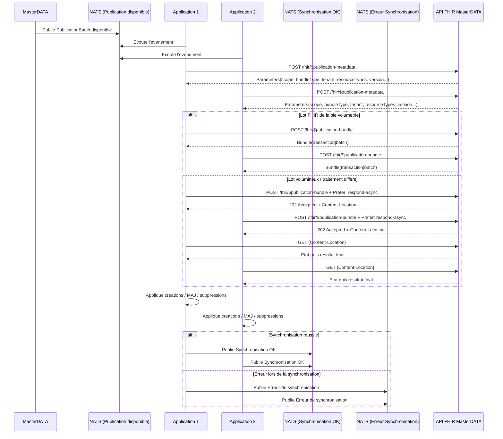

# Cas d'exemple NATS

## 1. Descriptif du flux evenementiel

Le systeme de publication recoit des evenements metier via NATS.

A partir de ces evenements, la chaine de publication :

- identifie la transaction metier source ;
- calcule les impacts sur les ressources FHIR ;
- decoupe les impacts en lots homogenes de diffusion ;
- genere les metadonnees de lot ;
- rend les lots consultables via les operations FHIR `$publication-metadata` et `$publication-bundle`.

## 1.1 Sequence de bout en bout



## 2. Contrat logique des evenements NATS

Le contenu exact des messages NATS depend du domaine metier.
Le patron minimal suivant est recommande pour alimenter la publication :

```json
{
  "eventId": "EVT-2026-000987",
  "eventType": "MASTERDATA.RESOURCE.UPSERTED",
  "occurredAt": "2026-03-30T09:14:58Z",
  "sourceTransactionId": "TX-2026-000987",
  "sourceVersionNum": 54,
  "scope": "CLIENT",
  "targetTenant": "ght21",
  "publicationViewCode": "ORG_GHT21",
  "impactedResources": [
    { "resourceType": "Organization", "id": "ORG-GHT21-4589" },
    { "resourceType": "Location", "id": "LOC-GHT21-775" }
  ]
}
```

## 3. Regles de transformation NATS vers publication

- Un message NATS peut produire un ou plusieurs lots de publication.
- Un lot doit rester homogene sur le perimetre de diffusion.
- Les lots GLOBAL et CLIENT sont separes.
- Le type de bundle (`transaction` ou `batch`) est determine par la vue de publication et le besoin de coherence.
- La notification NATS ne transporte pas la transaction metier brute ; elle transporte la disponibilite d'un `PublicationBatch`.

## 4. Cas d'exemple 1 : evenement client-specifique

### 4.1 Evenement NATS recu

Sujet NATS (exemple) :

`mdm.publication.client.ght21.upsert`

Payload :

```json
{
  "eventId": "EVT-2026-000987",
  "eventType": "MASTERDATA.RESOURCE.UPSERTED",
  "occurredAt": "2026-03-30T09:14:58Z",
  "sourceTransactionId": "TX-2026-000987",
  "sourceVersionNum": 54,
  "scope": "CLIENT",
  "targetTenant": "ght21",
  "publicationViewCode": "ORG_GHT21",
  "impactedResources": [
    { "resourceType": "Organization", "id": "ORG-GHT21-4589" },
    { "resourceType": "Location", "id": "LOC-GHT21-775" }
  ]
}
```

### 4.2 Lot genere

- publicationBatchId : `PB-2026-000145`
- scope : `CLIENT`
- targetTenant : `ght21`
- bundleType : `transaction`
- resources : `Organization`, `Location`

### 4.3 Consultation FHIR

1. Le consommateur appelle `$publication-metadata` avec `publicationBatchId`.
2. Le consommateur lit `bundleType=transaction`.
3. Le consommateur appelle `$publication-bundle` et recupere un Bundle coherent a appliquer comme unite.

Variante volumineuse :

1. Le consommateur appelle `$publication-bundle` avec `Prefer: respond-async`.
2. Le serveur retourne `202 Accepted` + `Content-Location`.
3. Le consommateur effectue le polling jusqu'au resultat final.

## 5. Cas d'exemple 2 : evenement mixte global + client

### 5.1 Evenement NATS recu

Sujet NATS (exemple) :

`mdm.publication.mixed.rebuild`

Payload :

```json
{
  "eventId": "EVT-2026-001200",
  "eventType": "MASTERDATA.REBUILD.REQUESTED",
  "occurredAt": "2026-03-30T11:00:00Z",
  "sourceTransactionId": "TX-2026-001200",
  "sourceVersionNum": 103,
  "impactedResources": [
    { "resourceType": "CodeSystem", "id": "nomenclature-acts" },
    { "resourceType": "Organization", "id": "ORG-GHT21-4589" }
  ]
}
```

### 5.2 Decoupage en lots

A partir d'un evenement unique, la publication genere deux lots :

- Lot A (GLOBAL)
  - publicationBatchId : `PB-2026-000200`
  - scope : `GLOBAL`
  - bundleType : `batch`
  - resources : `CodeSystem`

- Lot B (CLIENT)
  - publicationBatchId : `PB-2026-000201`
  - scope : `CLIENT`
  - targetTenant : `ght21`
  - bundleType : `transaction`
  - resources : `Organization`

### 5.3 Consultation FHIR

Le consommateur traite les lots separement :

- interrogation des metadonnees de `PB-2026-000200` puis lecture du bundle GLOBAL ;
- interrogation des metadonnees de `PB-2026-000201` puis lecture du bundle CLIENT.

Ce comportement garantit la separation stricte des perimetres de diffusion.

## 6. Cas d'exemple 3 : payload NATS minimal recommande

Sujet NATS global (exemple) :

`publication.global.codesystem.available`

Payload :

```json
{
  "messageId": "msg-001",
  "publicationBatchId": "PB-GLOBAL-001",
  "scope": "GLOBAL",
  "artifactType": "CodeSystem",
  "version": "2026-03"
}
```

Sujet NATS client (exemple) :

`publication.clientA.organization.available`

Payload :

```json
{
  "messageId": "msg-002",
  "publicationBatchId": "PB-CLIENTA-0456",
  "scope": "CLIENT",
  "targetTenant": "clientA",
  "resourceType": "Organization"
}
```

## 7. Cas d'erreur et reprise

Exemple de lot en echec :

- status : `FAILED`
- sourceTransactionId : `TX-2026-001200`
- publicationBatchId : `PB-2026-000201`

Strategie recommandee :

- le consommateur consulte periodiquement les metadonnees ;
- un lot `FAILED` n'est pas applique ;
- un nouveau lot de reprise est publie avec un nouvel identifiant de lot.

## 8. Lien avec les operations FHIR

- Definition de `$publication-metadata` : [OperationDefinition-publication-metadata.html](OperationDefinition-publication-metadata.html)
- Definition de `$publication-bundle` : [OperationDefinition-publication-bundle.html](OperationDefinition-publication-bundle.html)
- Capacites serveur : [CapabilityStatement-mdm-publication-server.html](CapabilityStatement-mdm-publication-server.html)
